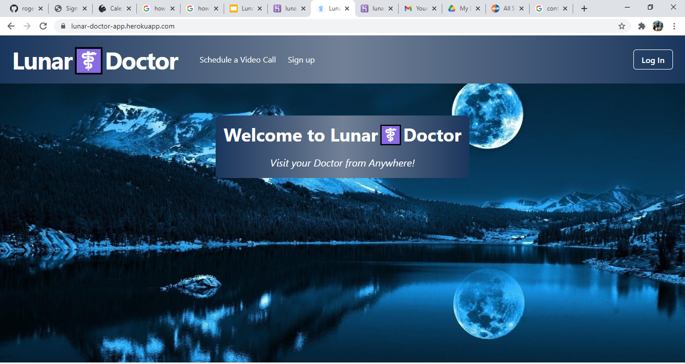

# Lunar Doctor Video

## Description 

Lunar Doctor is an application where you can create an account to schedule an appointment with a doctor. You login to the application, pick a date in the calendar, pick an available time and you will receive an email with a link to your video call with an available doctor.

It was made with MERN Stack and Daily.co API for getting the room for meetings and using Chakra-UI for styling.

## Table of Contents

* [URLs](#urls)
* [Installation](#installation)
* [Usage](#usage)
* [Contributing](#Contributing)
* [License](#license)
* [Test](#Test)
* [Questions](#questions)
* [Screenshots](#screenshots)

## URLs

* Deployed Application: 
    - [https://lunar-doctor-app.herokuapp.com/](https://lunar-doctor-app.herokuapp.com/) (live)

* GitHub Repository:
    - [HTTPS: https://github.com/rogers0404/lunar-video-app.git](https://github.com/rogers0404/lunar-video-app.git)
    - [GIT: git@github.com:rogers0404/lunar-video-app.git](git@github.com:rogers0404/lunar-video-app.git)

## Installation

You need some packages to run this application, 

- `git clone git@github.com:rogers0404/21-book-search-engine.git        //clone the repository`

Back-End

- `npm i express                    // or npm install express to get all packages and dependencies of Express`
- `npm i apollo-server-express       // or npm install apollo-server-express to get all packages and dependencies of Apollo`
- `npm i jsonwebtoken               // or npm install JSON WEB TOKEN `
- `npm install jwt-decode               // or npm install JSON WEB TOKEN decoding `
- `npm install nodemailer               // or npm install nodemailer for handle sendin emails `

Front-End

- `npx create-react-app book-search-engine       // or npx install to get all packages and dependencies of React`
- `npm i apollo-boost graphql graphql-tag @apollo/react-hooks       // or install libraries to get all packages and dependencies of Apollo Client, GraphQL and Apollo Hooks`
- `npm i @chakra-ui/react                                           // for styling`
- `npm i @daily-co/daily-js                                         //API for get access to video meeting`

Back-end and Front-End Integration 

- `npm install if-env               //checking the environment we're in and execute a select npm script`
- `npm install -D concurrently      //package for running multiple processes concurrently`

## Usage 

Developing Component Funtions in React:

`import React from 'react';`

`// add these two library import statements`
`import { ApolloProvider } from '@apollo/react-hooks';`
`import ApolloClient from 'apollo-boost';`
`import { BrowserRouter as Router, Switch, Route } from 'react-router-dom';`
`import SearchBooks from './pages/SearchBooks';`
`import SavedBooks from './pages/SavedBooks';`
`import Navbar from './components/Navbar';`

`const client = new ApolloClient({`
`  request: operation => {`
`    const token = localStorage.getItem('id_token');`

`    operation.setContext({`
`      headers: {`
`        authorization: token ? ``Bearer ${token}` `: ''`
`      }`
`    });`
`  },`
`  uri: '/graphql'`
`});`
`function App() {`
`  return (`
`  <ApolloProvider client={client}>`
`    <Router>`
`      <>`
`        <Navbar />`
`        <Switch>`
`           <Route exact path="/" component={Home} />`
`            <Route exact path="/login" component={Login} />`
`            <Route exact path="/signup" component={Signup} />`
`            <Route exact path="/schedule" component={Schedule} />`
`            <Route exact path="/myAppointment" component={Appointment} />`
`        </Switch>`
`      </>`
`    </Router>`
`    </ApolloProvider>`
`  );`
`}`

`export default App;`

The starting command-line is:

`npm run start                                 // to run the app and run server and client`

## Contributing

* Rogers Ramirez, Github User: [rogers0404](http://github.com/rogers0404)
* Victoria Landron, Github User: [viclandron27](http://github.com/viclandron27)
* Lynh Le, Github User: [skelatorian](http://github.com/skelatorian)
* Ron Gould, Github User: [R0nG13](http://github.com/R0nG13)

## License

Lunar Doctor Video App with MERN is licensed under the

None

## Test

None

## Questions

If you have any questions about the application, you can check the documentation on the GitHub profile [https://github.com/rogers0404/lunar-video-app](https://github.com/rogers0404/lunar-video-app).

for more information you can contact any of the contributors.

## Screenshots

### Screenshot 1

